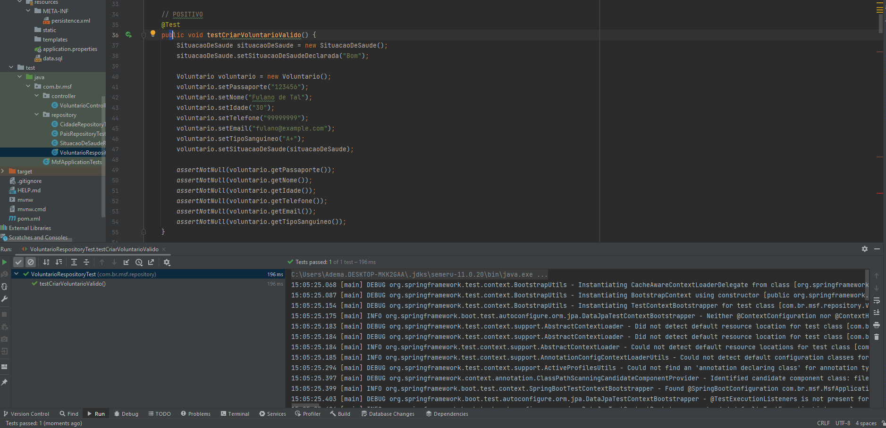
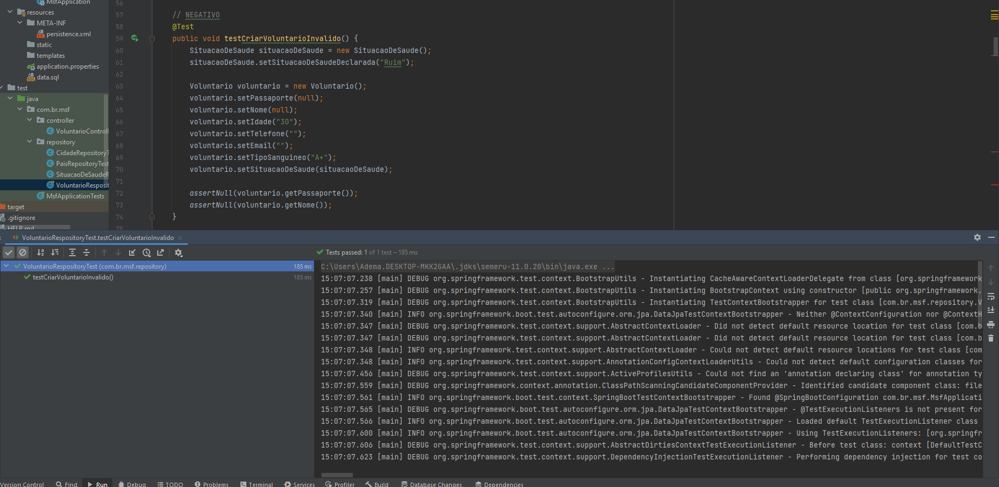
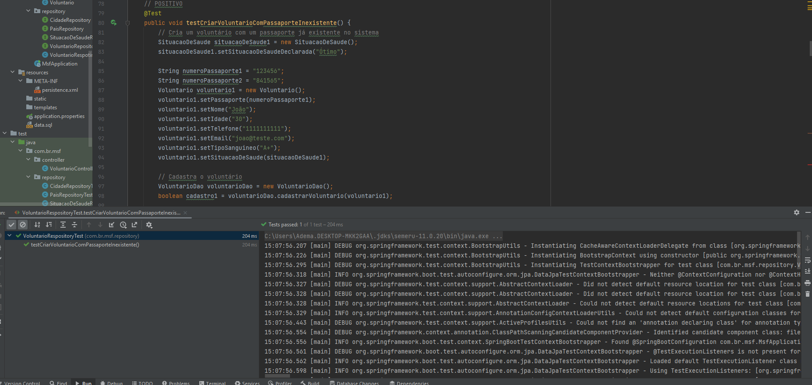
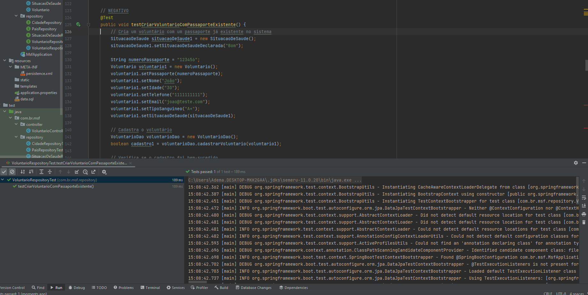
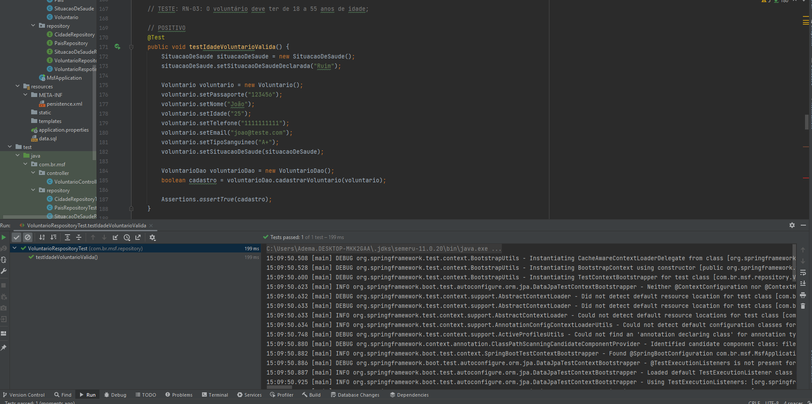
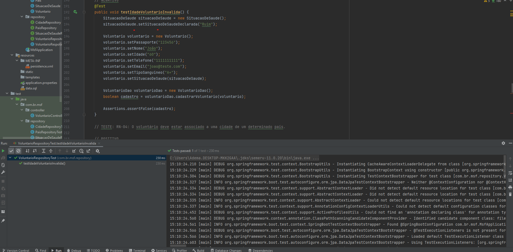
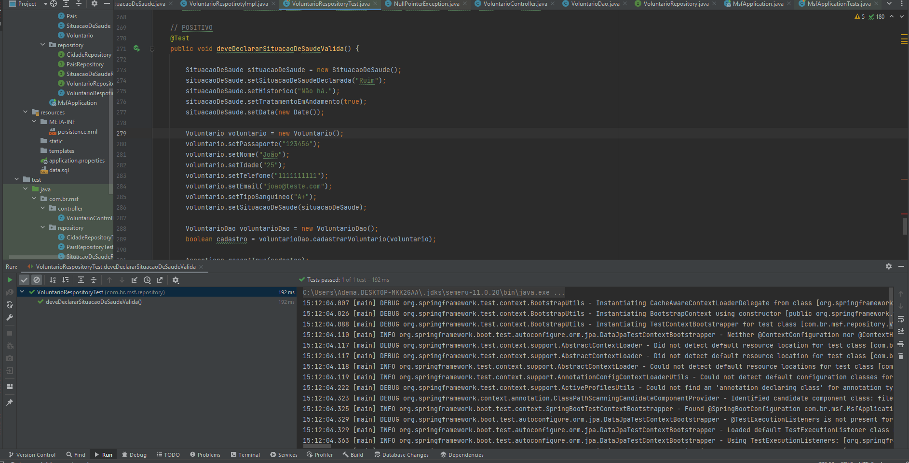
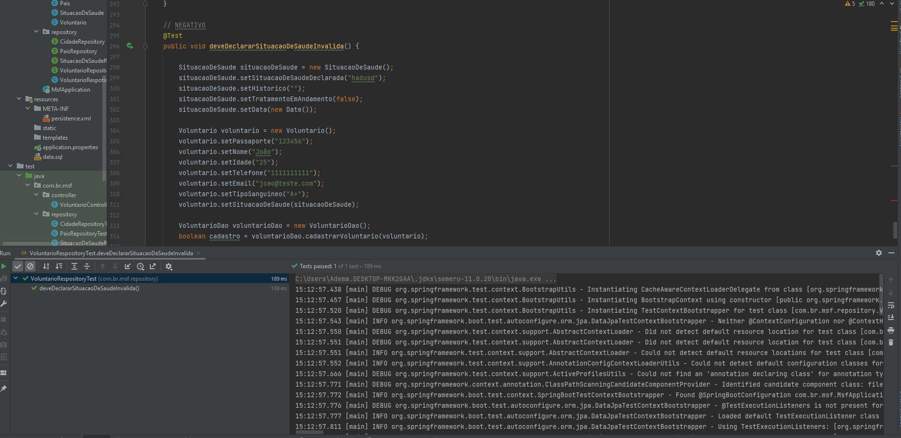

# DESENVOLVIMENTO NA PRÁTICA COM SPRING E TESTES

## Documento da Avaliação

## Breve explicação 💥

O objetivo desse projeto foi implementar testes automatizados para garantir o correto funcionamento da aplicação e prevenir erros em produção. 
Para isso, utilizei o framework Spring para criar uma aplicação Java que realiza operações de CRUD (Create, Read, Update, Delete) 
em um banco de dados utilizando o JPA (Java Persistence API).

Ao implementar os testes automatizados, pude garantir que a aplicação funcionava corretamente e que as operações de CRUD estavam sendo 
realizadas de forma adequada no banco de dados. Isso me permitiu detectar e corrigir eventuais erros antes que a aplicação fosse 
disponibilizada em produção, o que aumentou a qualidade e a confiabilidade da aplicação.

## Testes realizados 🧶

### RN-01: O voluntário deve ter os seguintes dados cadastrados (todos obrigatórios): Passaporte, Nome Completo, Idade, Telefone, E-mail e Tipo Sanguíneo.

#### POSITIVO

---

#### NEGATIVO

---

### RN-02: Um voluntário não pode ser cadastrado se já tiver um passaporte com o mesmo número no sistema.

#### POSITIVO

---

#### NEGATIVO

---

### RN-03: O voluntário deve ter de 18 a 55 anos de idade;

#### POSITIVO

---

#### NEGATIVO

---

### RN-05: O voluntário deve ter sua situação de saúde declarada (Opções: Ruim, Bom, Ótimo).

#### POSITIVO

---

#### NEGATIVO

---

### Conclusão 🎈

Em resumo, o projeto demonstrou a importância dos testes automatizados para garantir a qualidade e a confiabilidade de uma aplicação e como o ecossistema Spring pode ser utilizado para simplificar o desenvolvimento e a implementação desses testes.
