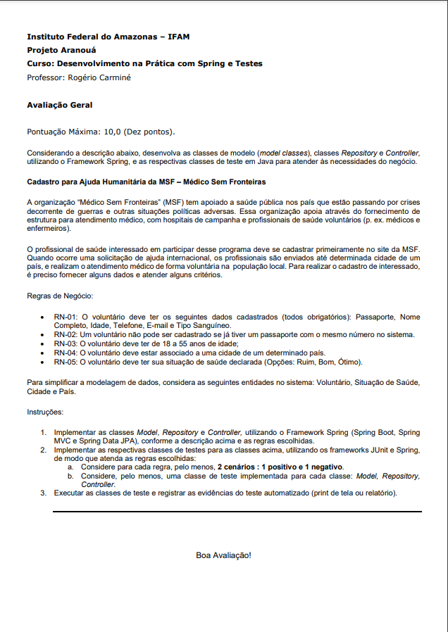

# Projeto de Aprendizagem do Curso de Spring e Testes

## Documento Oficial do Projeto



## Testes realizados


## Descrição do Projeto

Este projeto tem como objetivo implementar um sistema de cadastro para ajuda humanitária da organização "Médicos Sem Fronteiras" (MSF). A MSF é uma organização que apoia a saúde pública em países que enfrentam crises decorrentes de guerras e outras situações políticas adversas. Através do fornecimento de estrutura para atendimento médico, com hospitais de campanha e profissionais de saúde voluntários, como médicos e enfermeiros, a organização presta assistência nessas regiões.

O cadastro para se tornar um voluntário da MSF é realizado através do site da organização. Quando ocorre uma solicitação de ajuda internacional, os profissionais são enviados até determinada cidade de um país e prestam atendimento médico de forma voluntária à população local. Para se cadastrar como voluntário, é necessário fornecer alguns dados e atender a alguns critérios.

## Regras de Negócio

1. O voluntário deve ter os seguintes dados cadastrados (todos obrigatórios): Passaporte, Nome Completo, Idade, Telefone, E-mail e Tipo Sanguíneo.
2. Um voluntário não pode ser cadastrado se já tiver um passaporte com o mesmo número no sistema.
3. O voluntário deve ter de 18 a 55 anos de idade.
4. O voluntário deve estar associado a uma cidade de um determinado país.
5. O voluntário deve ter sua situação de saúde declarada (Opções: Ruim, Bom, Ótimo).

## Entidades do Sistema

Para simplificar a modelagem de dados, o sistema possui as seguintes entidades:

- Voluntário: Representa um profissional de saúde interessado em se tornar voluntário da MSF.
- Situação de Saúde: Enumeração com as opções de situação de saúde do voluntário (Ruim, Bom, Ótimo).
- Cidade: Representa uma cidade associada a um determinado país.
- País: Representa um país onde a MSF atua.

## Implementação

O projeto será desenvolvido utilizando o Framework Spring, incluindo as seguintes tecnologias:

- Spring Boot: Para configuração e inicialização da aplicação.
- Spring MVC: Para desenvolvimento dos controladores (Controllers) que irão gerenciar as requisições HTTP.
- Spring Data JPA: Para implementar os repositórios de acesso aos dados do banco de dados.

Serão criadas classes Model, Repository e Controller para as entidades do sistema, bem como classes de teste utilizando JUnit e Spring para garantir o correto funcionamento das funcionalidades implementadas.

## Testes

Os testes serão realizados para garantir o correto funcionamento das regras de negócio e das funcionalidades implementadas no sistema. Serão considerados, pelo menos, 2 cenários (positivo e negativo) para cada regra de negócio. Os testes serão organizados em classes específicas para cada entidade do sistema: Voluntário, Cidade e País.

## Instruções para Teste

Os testes foram organizados na classe VoluntarioRepositoryTest.java em ("src/test/com/br/msf/repository/"), seguindo a ordem estabelecida na atividade proposta. Todos os testes foram realizados em sequência.

### RN-01: O voluntário deve ter os seguintes dados cadastrados (todos obrigatórios): Passaporte, Nome Completo, Idade, Telefone, E-mail e Tipo Sanguíneo

- Positivo:
    - Cenário: Todos os dados cadastrais são informados corretamente
        - Cria-se um voluntário com todos os dados obrigatórios preenchidos corretamente (Passaporte, Nome Completo, Idade, Telefone, E-mail e Tipo Sanguíneo)
        - Verifica-se se o cadastro foi realizado com sucesso.
Negativo:
    - Cenário: O campo "Passaporte" não é informado
        - Cria-se um voluntário sem informar o número do passaporte
        - Verifica-se se o resultado é que o cadastro não foi realizado.
    - Cenário: O campo "Nome Completo" não é informado
        - Cria-se um voluntário sem informar o nome completo
        - Verifica-se se o resultado é que o cadastro não foi realizado.
    - Cenário: O campo "Idade" não é informado
        - Cria-se um voluntário sem informar a idade
        - Verifica-se se o resultado é que o cadastro não foi realizado.
    - Cenário: O campo "Telefone" não é informado
        - Cria-se um voluntário sem informar o telefone
        - Verifica-se se o resultado é que o cadastro não foi realizado.
    - Cenário: O campo "E-mail" não é informado
        - Cria-se um voluntário sem informar o e-mail
        - Verifica-se se o resultado é que o cadastro não foi realizado.
    - Cenário: O campo "Tipo Sanguíneo" não é informado
        - Cria-se um voluntário sem informar o tipo sanguíneo
        - Verifica-se se o resultado é que o cadastro não foi realizado.
    - Cenário: O campo "Passaporte" já está em uso por outro voluntário
        - Cria-se um voluntário com um passaporte que já está em uso por outro voluntário no sistema
        - Verifica-se se o resultado é que o cadastro não foi realizado.

### RN-02: Um voluntário não pode ser cadastrado se já tiver um passaporte com o mesmo número no sistema

- Positivo:
    - Cenário: Não há nenhum voluntário cadastrado no sistema com o mesmo número de passaporte
        - Cria-se um voluntário com um passaporte válido e todos os outros dados cadastrais
        - Verifica-se se o cadastro foi realizado com sucesso.

- Negativo:
    - Cenário: Já existe um voluntário cadastrado no sistema com o mesmo número de passaporte
        - Cria-se um voluntário com um passaporte que já está em uso por outro voluntário
        - Verifica-se se o resultado é que o cadastro não foi realizado.

### RN-03: O voluntário deve ter de 18 a 55 anos de idade

- Positivo:
    - Cenário: O voluntário tem exatamente 18 anos de idade
        - Cria-se um voluntário com 18 anos de idade
        - Verifica-se se o cadastro foi realizado com sucesso.
    - Cenário: O voluntário tem exatamente 55 anos de idade
        - Cria-se um voluntário com 55 anos de idade
        - Verifica-se se o cadastro foi realizado com sucesso.

- Negativo:
    - Cenário: O voluntário tem menos de 18 anos de idade
        - Cria-se um voluntário com 17 anos de idade
        - Verifica-se se o resultado é que o cadastro não foi realizado.
    - Cenário: O voluntário tem mais de 55 anos de idade
        - Cria-se um voluntário com 56 anos de idade
        - Verifica-se se o resultado é que o cadastro não foi realizado.

### RN-04: O voluntário deve estar associado a uma cidade de um determinado país

- Positivo:
    - Cenário: A cidade e o país informados existem no sistema
        - Cria-se um país e uma cidade válidos no sistema
        - Cria-se um voluntário associado a essa cidade e país
        - Verifica-se se o cadastro foi realizado com sucesso.
        
- Negativo:
    - Cenário: A cidade informada não existe no sistema
        - Cria-se um país válido no sistema
        - Cria-se um voluntário associado a uma cidade inexistente
        - Verifica-se se o resultado é que o cadastro não foi realizado.
    - Cenário: O país informado não existe no sistema
        - Cria-se uma cidade válida no sistema
        - Cria-se um voluntário associado a um país inexistente
        - Verifica-se se o resultado é que o cadastro não foi realizado.

### RN-05: O voluntário deve ter sua situação de saúde declarada (Opções: Ruim, Bom, Ótimo)

- Positivo:
    - Cenário: A situação de saúde informada é válida (Ruim)
        - Cria-se um voluntário com situação de saúde declarada como "Ruim"
        - Verifica-se se o cadastro foi realizado com sucesso.
    - Cenário: A situação de saúde informada é válida (Bom)
        - Cria-se um voluntário com situação de saúde declarada como "Bom"
        - Verifica-se se o cadastro foi realizado com sucesso.
    - Cenário: A situação de saúde informada é válida (Ótimo)
        - Cria-se um voluntário com situação de saúde declarada como "Ótimo"
        - Verifica-se se o cadastro foi realizado com sucesso.

- Negativo:
    - Cenário: A situação de saúde informada não é válida
        - Cria-se um voluntário com situação de saúde declarada como "Regular"
        - Verifica-se se o resultado é que o cadastro não foi realizado.
    - Cenário: A situação de saúde não é informada
        - Cria-se um voluntário sem informar a situação de saúde
        - Verifica-se se o resultado é que o cadastro não foi realizado.

##  Observação:

- Os testes foram organizados na classe VoluntarioRepositoryTest.java seguindo a ordem estabelecida na atividade proposta, com dois cenários (Positivo e Negativo) para cada Requisito de Negócios. No entanto, é importante lembrar que novos testes podem ser elaborados e organizados para verificar diversos cenários e garantir a correta aplicação dos requisitos.

## Execução dos Testes

Os testes automatizados foram executados e as evidências estão disponíveis no arquivo "Testes.png" na pasta raiz do projeto.

## Misc

- Não é obrigatório informar a cidade e o país.
- É obrigatório informar pelo menos a situacaoDeSaudeDeclarada da classe SituacaoDeSaude.

```json
{
    "situacaoDeSaudeDeclarada": "Bom"
}
{
    "passaporteId": "123456",
    "nomeCompleto": "Ademar Castro",
    "idade": 19,
    "telefone": "99999999",
    "email": "ademar@gmail.com",
    "tipoSanguineo": "O-",
    "situacaoDeSaude": situacaoDeSaude,
    "cidade": cidade
}
```

### Conclusão 🎈

O projeto demonstrou a importância dos testes automatizados para garantir a qualidade e a confiabilidade de uma aplicação e como o ecossistema Spring pode ser utilizado para simplificar o desenvolvimento e a implementação desses testes.
